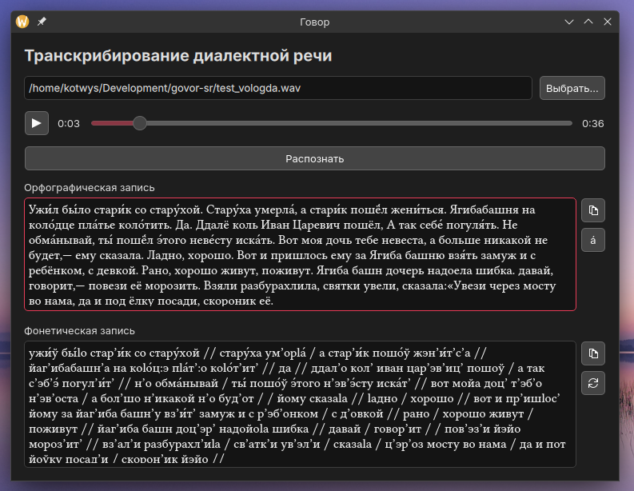

<!--
Код размещён в репозитории на GitHub:
https://github.com/kotwys/govor-sr
-->

# Говор



Простая программа для полуавтоматизированного транскрибирования русской
диалектной речи. Модель нейросети распознаёт текст из аудиозаписи в
орфографической записи, которая затем с помощью набора правил, составленного для
определённого диалекта, преобразуется в фонетическую запись.

## Требования

Для работы программы необходимы следующие компоненты:

- Операционная система Windows 10 / 11 (или аналогичная актуальная версия macOS,
  Linux);
- Python 3.13 или новее.

Также необходимо установить зависимости:

```bash
pip install onnx-asr[cpu]>=0.11.0 pyside6>=6.11.0
```

В папке `models/gigaam` должны быть расположены файлы модели GigaAM v3 [из этого
репозитория][gigaam]:

- `v3_e2e_ctc.onnx`
- `v3_e2e_ctc.yaml`
- `v3_e2e_ctc_vocab.txt`

## Запуск

Для запуска программы введите следующую команду в папке с данным репозиторием:

```
python -m govor
```

## Использование

Для транскрибирования файла аудиозаписи, нажмите на кнопку «Выбрать…» в верхней
части окна и выберите в появившемся окне WAV-файл аудиозаписи. Выбранный файл
можно прослушать.

Затем нажмите на кнопку «Распознать». В зависимости от длины аудиозаписи
и мощности компьютера распознавание займёт некоторое время. Рекомендуется
использовать аудиофайлы не дольше 1–2 минут. По завершении анализа в окне
«Орфографическая запись» появится распознанный текст.

Полученный текст можно свободно редактировать. При любых изменениях будет
обновляться также окно «Фонетическая запись». Текст во втором окне составляется
автоматически на основе файла правил `rules.go`. Автоматическая расстановка
ударений **не осуществляется** — пользователь может их расставить вручную с
помощью кнопки «Поставить ударение перед курсором» в окне «Орфографическая
запись».

Во время работы программы набор правил можно менять. После внесения
изменений необходимо нажать на кнопку «Обновить список правил» справа от окна
«Фонетическая запись».

## Описание правил

Составление фонетической записи происходит на основе «фонемного» анализа текста
в орфографической записи. Однако, для целей диалектической транскрипции в
анализ не включается редукция гласных, оглушение согласных и некоторые другие
позиционные изменения. Здесь и далее слово «фонема» используется в нестрогом
смысле как единица анализа.

Каждая фонема представлена буквой русского алфавита. Помимо этого, каждая фонема
обладает набором свойств.

Для согласных фонем определены следующие бинарные свойства (вначале указано
«отрицательное» значение оппозиции, затем «положительное»):
- `слаб`: сильная или слабая позиция (перед глухими согласными или на конце
  слова);
- `долг`: краткость или долгота;
- `мягк`: твёрдость или мягкость.

Для гласных фонем единственным свойством является положение относительно
ударного слога. Оно выражается целым числом со знаком: если гласная ударная, то
это `0`, если первая предударная — `-1`, первая заударная — `+1` и т. д. Если
в слове не проставлено ударение, то это свойство не установлено. Для упрощения
написания правил также считается, что безударные гласные (либо гласные в словах,
где ударение не проставлено) имеют положительное свойство `слаб`.

Например, слово «говоря́щих» разбирается следующим образом:

| Фонема | Свойства       |
|--------|----------------|
| г      |                |
| о      | `-2` (`слаб`)  |
| в      |                |
| о      | `−1` (`слаб`)  |
| р      | `мягк`         |
| а      | `0`            |
| ш      | `долг`, `мягк` |
| и      | `+1` (`слаб`)  |
| х      | `слаб`         |

Описание правил преобразования осуществляется в файле `rules.go`. В каждой
строке (за исключением пустых строк и строк комментариев, начинающихся с `//`)
расположено правило преобразования, например:

```go
// Безударное ёканье
(С мягк) (э слаб) (С -мягк) = 1 2/о 3
```

Слева от знака «равно» указывается шаблон из одной или более фонем, который
необходимо заменить. Справа указывается правило замены.

Шаблон фонемы в общем случае представляет собой символ фонемы и перечисление
свойств, которым она должна соответстовать, в скобках. Если свойство указано
с плюсом или без знака, то соответствующее свойство должно иметь положительное
значение. Если перед свойством указан знак «-» (дефис на клавиатуре),
то свойство должно быть отрицательным. Не указанные в шаблоне свойства
игнорируются.

Если для фонемы не указано свойств, то скобки можно опустить. Также вместо
конкретной фонемы можно указать один из _стереотипов_:
- `С`: все согласные,
- `Г`: все гласные,
- `К`: все заднеязычные согласные (_г_, _к_, _х_),
- `А`: все гласные неверхнего подъёма (_а_, _о_, _э_).

Если какая-либо группа фонем соответствует указанному шаблону, то каждой из них
присваивается порядковый номер, начиная с 1. В правиле замены можно использовать
эти номера для подстановки соответствующей фонемы. Также через знак обратной
черты можно произвести модификации фонемы: заменить саму фонему или присвоить ей
какие либо новые свойства. Аналогично, если в модификации не фигурирует никаких
свойств, то скобки можно опустить.

Если слева и справа от знака равно приведена только одна фонема, то
справка указывать `1/` не требуется, автоматически происходит модификация
соответствующей шаблону фонемы.

Если в конце шаблона присутствует знак `$`, то правило выполняется только в
конце слова.

Примеры правил можно увидеть в файле [`rules.go`](./rules.go).

## Устранение неполадок

### No module named ‘huggingface_hub’

Эта ошибка говорит о том, что отсутствует папка `models/gigaam` с моделью
распознавания.

Наиболее надёжным способом решения проблемы будет ручное скачивание и размещение
в упомянутой папке файлов модели, указанных в разделе [Требования](#требования).

Модели также могут быть установлены автоматически при установке указанного
модуля, но могут накладываться ограничения по скорости и объёму загрузки.

```bash
pip install huggingface_hub
```

### 'Bridge' object has no attribute '_engine'

Попробуйте перезагрузить список правил с помощью кнопки «Обновить список
правил» в правой части окна «Фонетическая запись». Если снова появляется ошибка,
проверьте наличие файла `rules.go` в рабочей директории (откуда запускается
программа). Для корректной работы данный файл должен иметь кодировку UTF-8.

[gigaam]: https://huggingface.co/istupakov/gigaam-v3-onnx/tree/main
